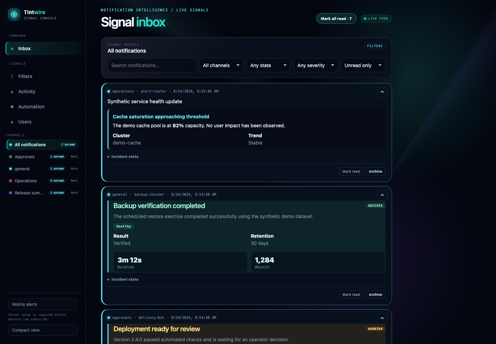
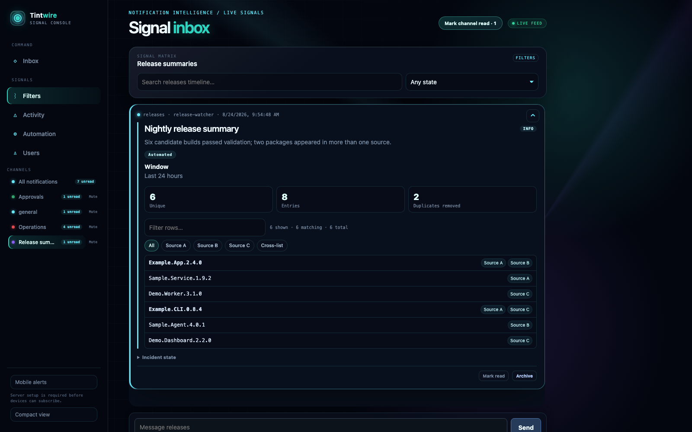

# Tintwire

Tintwire is a self-hosted rich-notification inbox for structured, interactive
cards. It is intended to provide a focused alternative to routing operational
notifications through a general-purpose chat system.

> **Work in progress:** Tintwire is under active development. Interfaces,
> configuration, deployment procedures, and database schemas may change without
> notice. It is not yet recommended for production use without careful review
> and backups.

Tintwire combines:

- Rich cards with semantic color, typography, fields, tables, images, and
  authenticated actions.
- Installable PWA delivery with mobile and desktop Web Push alerts, unread
  badges, and deep links back to the originating notification.
- Compatibility with existing Mattermost and Slack webhook payloads.
- Preservation of existing Mattermost `/hooks/{id}` URLs for low-friction
  migration.
- Compatibility for existing Mattermost custom slash commands, including their
  external callbacks and delayed responses.
- A bounded Mattermost bot API bridge for integrations such as `release_watcher` and
  `approval-service`.
- Native typed commands, approvals, and durable action events.
- Highly available stateless application nodes backed by PostgreSQL HA.
- Optional Cloudflare Tunnel replicas for a stable, highly available ingress
  hostname without a mandatory load balancer.

## Screenshots

[](docs/screenshots/inbox.png)

The signal inbox combines compatibility webhooks and native structured cards
with channel, severity, lifecycle, search, and unread controls.

[](docs/screenshots/release-summary.png)

Channel timelines can present dense, filterable card rows alongside ordinary
conversation and the channel composer.

## Project status

Tintwire includes channels and scoped publishing tokens, structured cards,
history, search, filters, unread state, realtime delivery, an installable PWA
with Web Push, Mattermost and Slack webhook compatibility, bounded Mattermost
bot and slash-command bridges, notification lifecycle and HTTP actions, agent
principals with an authenticated MCP surface, and a Tauri desktop client.

SQLite is supported for local and single-node use. PostgreSQL is supported when
the application needs shared state across multiple stateless nodes. Deployment
topology, ingress, backups, and database failover are intentionally left to the
operator.

- [Interactive release-summary mockup](docs/mockups/release-list-rich-notification.html)
- [Client validation checklist](docs/CLIENT_VALIDATION.md)
- [Desktop release policy](docs/DESKTOP_RELEASES.md)

## Development quick start

Tintwire is a single Go service that serves the web client itself and supports
SQLite for local development or PostgreSQL for multi-node deployments. The
quickest way in is one webhook-backed
channel with no authentication.

Start it with an explicit development webhook token:

```sh
export TINTWIRE_HOOK_TOKEN=local-development-hook
go run ./cmd/tintwire -hook-id "$TINTWIRE_HOOK_TOKEN"
```

Then publish a notification:

```sh
curl -i \
  -H 'Content-Type: application/json' \
  -d '{"text":"Hello from Mattermost","username":"example-bot"}' \
  http://127.0.0.1:8080/hooks/local-development-hook
```

Open `http://127.0.0.1:8080/` to see the notification. The default database is
`tintwire.db`; the service listens only on loopback unless `-listen` or
`TINTWIRE_LISTEN` is set. The webhook token is a secret URL credential and is
stored only as a SHA-256 hash.

The same channel-scoped token can publish a version 1 native card:

```sh
curl -i \
  -H "Authorization: Bearer $TINTWIRE_HOOK_TOKEN" \
  -H 'Content-Type: application/json' \
  -d '{"version":1,"channel":"#release-lists","title":"Daily release summary","summary":"3 unique from 4 entries","severity":"info","source":"release_watcher","metrics":[{"label":"Unique","value":3}],"rows":[{"primary":"Example.Show.S01E01","tags":["Source A","Source B"],"emphasis":"strong"}]}' \
  http://127.0.0.1:8080/api/v1/notifications
```

Native cards support a title, summary, severity, source, metrics, labeled
fields, tone-limited badges, lazy-loaded images with required alternative text,
safe HTTP(S) links, filterable tagged rows, source and cross-list row views, and
registered or link actions. An optional `channel` selects a public destination
when the publishing webhook is unlocked; locked webhooks remain scoped to their
configured channel. Component counts and text lengths are bounded;
unknown fields, unsafe URL schemes, and unsupported component types are rejected
so producer content remains declarative and script-free. Synthetic redacted
contracts for a release summary, `approval-service`, and slash commands live in
`testdata/compat`; the interactive rendering reference is in `docs/mockups`.
Remote images use a no-referrer policy, but loading a producer-selected image
URL still reveals the approximate view time and reader network address to that
image host. Disable or proxy remote images at the deployment boundary when
producers are not trusted with that privacy signal.

The inbox search bar searches compatibility text, attachment content, native
card content, sources, and channel names. Channel, lifecycle state, and native
severity filters can be combined; the corresponding API query parameters are
`q`, `channel`, `state`, `severity`, and `limit` (maximum 200). History uses the
opaque `next_cursor` returned by the API as the subsequent `before` parameter;
the inbox exposes this as **Load more**.

Simple scripts can publish either plain text or a small generic JSON message to
`POST /api/v1/messages` with the same bearer token:

```sh
curl -H "Authorization: Bearer $TINTWIRE_HOOK_TOKEN" \
  -H 'Content-Type: text/plain' \
  --data 'nightly job completed' \
  http://127.0.0.1:8080/api/v1/messages
```

The JSON form accepts `text` and an optional `source`; additional fields are
rejected instead of being interpreted as markup.

Set a reader password to protect inbox, activity, realtime, and push APIs with a
server-side login session:

```sh
TINTWIRE_READER_USERNAME=admin \
TINTWIRE_READER_PASSWORD='use-a-long-unique-password' \
TINTWIRE_PUBLIC_URL='http://127.0.0.1:8080' \
go run ./cmd/tintwire -hook-id local-development-hook
```

Reader passwords must contain at least 12 characters. Passwords are stored as
bcrypt hashes; random session credentials are stored only as SHA-256 hashes and
sent in HttpOnly, SameSite=Strict cookies. Omitting the reader password retains
the loopback development mode and logs a warning. Do not expose that mode beyond
a trusted access boundary.

Authentication requires `TINTWIRE_PUBLIC_URL`; set it to the exact browser
origin, for example `https://tintwire.example.com` or the local origin shown
above. Tintwire fails closed at startup without it, requires that origin and host
on browser mutations, and marks session cookies `Secure` for HTTPS origins even
when the loopback proxy connection is plain HTTP. It deliberately does not trust
arbitrary `X-Forwarded-*` headers.

Interactive Pocket ID sign-in is available when `TINTWIRE_OAUTH_ISSUER` and
`TINTWIRE_OIDC_CLIENT_ID` are set. Register the callback
`$TINTWIRE_PUBLIC_URL/api/v1/auth/oidc/callback` as a public client with PKCE,
then use **Continue with Pocket ID** on the login screen. Tintwire verifies the
authorization code, PKCE challenge, issuer, audience, nonce, and one-time state.
The first successful login provisions a non-administrator local reader keyed by
the immutable OIDC subject; it never links an existing local account by display
name or email. Promote or grant channel membership through the normal Tintwire
administrator controls.

Authenticated readers have durable per-channel read cursors. New and updated
cards are highlighted, the PWA badge reflects the unread total where supported,
and the clickable channel navigation shows total, unread, and actively firing
counts. Channel selection is retained in the URL and rendered as a desktop
sidebar or a compact mobile channel picker. **Mark channel read** advances the
selected channel cursor; **Mark all read** advances all channel cursors
atomically. Web Push
subscriptions are attached to the authenticated reader and can only be revoked
by their owner.

Installation administrators can create additional readers with
`POST /api/v1/users`, create public or private channels with
`POST /api/v1/channels`, and assign `viewer`, `operator`, or `channel_admin`
membership with `PUT /api/v1/channels/{id}/members/{username}`. Channel creation
returns a random channel-scoped publishing token exactly once; only its SHA-256
hash is retained. Private channels are excluded from notification queries and
channel navigation unless the reader is an installation administrator or an
explicit member.

The admin-only **Users** panel lists human and system identities and their
authentication type. It can promote or demote administrators, enable or disable
human access, revoke sessions, reset local passwords, and assign explicit
channel roles. It prevents self-disablement and removal of the final enabled
human administrator; changes are recorded in the administrative audit log.

Operators and channel administrators can acknowledge or resolve notifications
from the inbox. Transitions are validated (`received`/`firing` to
`acknowledged` or `resolved`, then `acknowledged` to `resolved`), repeated
requests are idempotent, and each accepted transition becomes an immutable
activity event attributed to the authenticated reader. Private-channel activity
history applies the same membership check as the main feed.

Native cards may also contain registered HTTP actions. Configure a separate
installation encryption key before publishing or registering them:

```sh
export TINTWIRE_ACTION_KEY="$(openssl rand -base64 32)"
```

`TINTWIRE_ACTION_KEY` is bootstrap material only with respect to the environment
file. The first action-target save
or slash-command import commits it to cluster application settings as
`action_encryption_key` before storing the encrypted credential. Runtime
encryption and decryption use only that stored setting, so
application nodes cannot silently fall back to different node-local keys. If
neither the setting nor valid bootstrap material is
available, the server still starts but credential operations return `503`.

The committed key is stored in the same database as the ciphertext. Database
read access, a database dump, or a backup containing `app_settings` therefore
provides the material needed to decrypt stored action-target and slash-command
credentials. Protect database accounts, dumps, and every backup copy as secret
credential material; database encryption here protects accidental API exposure,
not an attacker who can read the complete database.

For legacy SQLite installations, back up the bootstrap key separately from the
database until the committed setting has been verified. When upgrading an
installation that already has encrypted credentials but no
`action_encryption_key` setting, use the legacy key that encrypted those
credentials as the bootstrap value and re-save each action target and imported
slash command before relying on failover. Do not seed the setting from an
arbitrary replica's environment. Credentials previously written with different
node-local keys must be re-entered under one chosen canonical key.

Administrators register an exact callback destination with
`PUT /api/v1/action-targets/{name}`; HTTPS is required unless the request
explicitly opts into a private target. `DELETE /api/v1/action-targets/{name}`
revokes a target cluster-wide; existing cards remain in history but can no
longer invoke it. Optional bearer credentials and per-card callback context are
AES-GCM encrypted before storage and are never returned by inbox APIs. The
dispatcher resolves and revalidates destination addresses,
blocks private/link-local/loopback addresses unless explicitly allowed, refuses
redirects, limits callback time and response size, forwards an idempotency key,
and records an immutable success or failure event. Clients must send a unique
`Idempotency-Key` when invoking
`POST /api/v1/notifications/{id}/actions/{index}`.

Existing Mattermost hook credentials can be planned and imported through
`POST /api/v1/admin/import/webhooks`. The strict JSON request contains
`dry_run` and a `webhooks` array of `{id, channel, channel_locked}` mappings.
`channel_locked` defaults to `false` when omitted. An unlocked imported hook may
override its destination only to an existing public Tintwire channel. Imports are atomic
and idempotent; duplicate IDs, unknown channels, and attempts to remap an ID
fail closed. Responses report only created/existing counts and never echo hook
IDs.

Authenticated installation administrators can also manage incoming webhooks in
the **Automation** panel. `POST /api/v1/webhooks` creates a random
channel-scoped hook and returns its `/hooks/{token}` path exactly once;
`GET /api/v1/webhooks` returns only non-secret metadata; and
`POST /api/v1/webhooks/{id}/revoke` immediately disables future deliveries
without deleting notifications previously received through that hook. Payload
channel overrides are enabled by default and remain limited to existing public
channels; administrators can lock or unlock each hook in the **Automation** panel.

### Mattermost bot bridge

Administrators can map an existing bot bearer token, Tintwire user, Mattermost
team alias, and channel with `POST /api/v1/admin/import/mattermost-bot`. The
token is stored only as a SHA-256 hash and is restricted to that channel. The
bounded bridge implements:

```text
GET  /api/v4/users/me
GET  /api/v4/users/username/{username}
GET  /api/v4/teams/name/{team}/channels/name/{channel}
GET  /api/v4/channels/{channel_id}/posts?since={timestamp}
POST /api/v4/posts
GET  /api/v4/posts/{post_id}/reactions
```

Top-level bot posts become inbox notifications; `root_id` replies become
immutable activity entries. Post timestamps are monotonic within a channel so
polling cannot miss same-millisecond writes. Operators see explicit Approve and
Reject controls for compatibility posts, exposed to legacy bots as the
authenticated user's `white_check_mark` or `x` reaction.

Mattermost attachment actions are also supported for bounded integrations such
as `approval-service`. An administrator must first register the action's exact
callback URL as an action target. Callback URLs and opaque action context are
replaced with an encrypted target reference before storage and are never exposed
by inbox APIs. A click is authorized against the stored card, reconstructs the
actor, post, and channel identity on the server, and uses the same SSRF-safe,
bounded, no-redirect dispatcher as native HTTP actions. Clients invoke
`POST /api/v1/notifications/{id}/mattermost-actions/{attachment}/{action}` with
a unique `Idempotency-Key`; the compatible response and immutable audit entry
are reused for retries.

### Mattermost custom slash commands

Administrators can atomically import existing command definitions with
`POST /api/v1/admin/import/slash-commands`. Each definition supplies its
Mattermost team, trigger, display and autocomplete metadata, `GET` or `POST`
request URL, command token, and optional `allow_private` flag. The action key is
required: authorization tokens are AES-GCM encrypted, fingerprinted only for
idempotent conflict detection, and never returned by command metadata or result
APIs.

Prefer `POST` command targets. Mattermost-compatible `GET` targets remain
available for legacy integrations, but necessarily place the decrypted command
token and other form fields in the query string, where the target's access logs
may retain them.

Authenticated users run imported commands from the keyboard command box or
`POST /api/v1/commands` with `{team, channel, command, text}`. Tintwire resolves
the selected channel and actor on the server and sends the Mattermost-compatible
form fields, including a fresh `trigger_id` and scoped `response_url`. Outbound
requests use the same DNS/IP validation, explicit private-target opt-in,
no-redirect policy, timeout, and response-size bound as interactive actions.
Command submissions require a unique `Idempotency-Key`; retries replay the
stored result without contacting the integration again, and reuse with different
command data is rejected.
Immediate plain-text and JSON responses are stored in the durable command
history; unsafe `goto_location` schemes are removed. Opaque delayed response
URLs expire after 30 minutes and accept at most five deliveries. Ephemeral
responses remain scoped to the invoking user, while `in_channel` results are
visible only to users allowed to read that channel. Results are available at
`GET /api/v1/commands/{id}/responses`.

The web client runs imported commands and ordinary messages from the selected
channel's composer. Human messages, notification cards, shared or ephemeral
command responses, bot output, and replies render in one authorized timeline;
shared timeline items participate in search, unread state, notification
preferences, and safe deep links.

Mattermost-compatible ingestion accepts JSON, URL-encoded `payload`, and
multipart `payload` request forms containing `text`, `username`,
`icon_url`, and top-level Mattermost `attachments`. A payload-level `channel`
override is honored for unlocked hooks, but only when it names an existing public
channel. New and bootstrapped hooks allow overrides by default; administrators can
lock individual hooks to their configured channel. Attachment colors support Slack/Mattermost `danger`,
`warning`, and `good` values plus validated hex colors. Text renders a restricted,
safe subset of Slack/Mattermost markup: bold text, inline code, line breaks, and
HTTP(S) links. Mattermost pipe tables, including column alignment, render as
responsive HTML tables. The inbox uses a server-sent event stream to refresh
when new notifications arrive. Alertmanager Slack notifications whose titles
begin with `[FIRING:n]` and `[RESOLVED]` are correlated by their normalized title:
the resolved payload updates the existing card while both deliveries remain in
the immutable notification event history. Cards with multiple lifecycle events
show a lazy-loaded activity timeline; its API returns only sanitized presentation
fields and never exposes the stored raw compatibility payload.

Slack Block Kit `header`, `section`, `fields`, `context`, `divider`, `image`,
and link-button `actions` are normalized into the restricted safe renderer.
Unknown block types become visible inert fallback text, and non-HTTP(S) links
are never made clickable.

### Agents

Agents are first-class principals rather than shared API tokens. An installation
administrator can register, inspect, and revoke them in the **Automation**
panel or register one with `POST /api/v1/agents`:

```sh
curl -H 'Content-Type: application/json' \
  -d '{"name":"triage","display_name":"Triage","description":"Investigates alerts"}' \
  https://tintwire.example.com/api/v1/agents
```

Agent administration requires an authenticated installation administrator, so
reader authentication must be enabled. Registration returns the agent's access
token exactly once; only its SHA-256
hash is retained, and later reads never expose it. Each agent gets its own
principal user named `agent-<name>`, so channel access is granted with the same
`PUT /api/v1/channels/{id}/members/{username}` endpoint used for people. An
agent has no implicit access to any channel, including public ones: publishing
requires an explicit `operator` or `channel_admin` membership, or an agent
registered with `"is_admin": true`.

Agent access tokens are a separate credential class from reader sessions,
channel publishing tokens, and Mattermost bot tokens, and are never accepted as
browser session credentials. `GET /api/v1/agents` lists the directory with
ownership, channel grants, and last credential use.
`POST /api/v1/agents/{name}/revoke` disables the agent, revokes its credentials,
and cancels its open runs without affecting its owner's session or any other
agent.

Work is recorded as durable runs. A run holds its initiator, stated purpose,
lifecycle state, and the externally visible effects it produced; model
reasoning, prompts, and hidden context are not stored. Administrators read run
history with `GET /api/v1/agents/{name}/runs` and per-run effects with
`GET /api/v1/agents/runs/{id}/events`. Notifications an agent publishes are
attributed to both the agent and its run, and the inbox API returns the agent
name in the notification's `agent` field.

### Model Context Protocol

Agents reach Tintwire through a remote MCP endpoint at `POST /mcp`, using the
sessionless Streamable HTTP transport. The deprecated HTTP+SSE transport is not
offered, and batched JSON-RPC requests are rejected. The endpoint speaks
protocol version `2026-07-28` and also accepts `2025-11-25` and `2025-06-18`;
an unsupported `MCP-Protocol-Version` header is refused.

Authentication is the agent's own access token as a bearer credential. Reader
session cookies are never accepted, and the endpoint calls the same store
authorization used by the HTTP API rather than a second privileged path:

```sh
curl -H "Authorization: Bearer $TINTWIRE_AGENT_TOKEN" \
  -H 'Content-Type: application/json' \
  -d '{"jsonrpc":"2.0","id":1,"method":"tools/list"}' \
  https://tintwire.example.com/mcp
```

Tool names are versioned: `channels.list.v1`, `notifications.search.v1`,
`notifications.get.v1`, `notifications.publish.v1`,
`notifications.set_state.v1`, `notifications.invoke_action.v1`, `runs.start.v1`, `runs.record.v1`,
`runs.finish.v1`, and, for installation-administrator agents only,
`channels.create.v1`. Every mutating tool requires a stable `idempotency_key`:
a repeat of the same call replays the first result without repeating the effect,
and reusing a key with different arguments is rejected as a conflict. A replayed
`channels.create.v1` result never repeats the publishing token. Tool traffic is
rate limited per agent and per agent and tool.

Read tools return canonical IDs, state, and sanitized presentation text so
agents do not scrape rendered markup; raw compatibility payloads and stored
action credentials are never exposed. Read-only resources are published at
`tintwire://channels`, `tintwire://channels/{name}`,
`tintwire://notifications/{id}`, and `tintwire://notifications/{id}/activity`.

Notification content, attachment text, and activity history are untrusted
producer data. The server states this in its MCP instructions, and enforces
authorization, idempotency, and state-transition policy itself: tool
descriptions and client annotations are never treated as a security boundary.

MCP action invocation uses the same registered-target lookup, channel-operator
authorization, encrypted context, SSRF protection, and durable idempotency path
as the web client. RFC 9728 protected-resource metadata is published at the
standard well-known location and linked from bearer challenges when
`TINTWIRE_PUBLIC_URL` is configured. Tintwire can validate Pocket ID API access
tokens through OIDC discovery and its rotating JWKS. Configure
`TINTWIRE_OAUTH_ISSUER`; the default resource is
`$TINTWIRE_PUBLIC_URL/mcp` and the default required permission is
`tintwire:mcp`. Validation requires a valid signature, exact issuer, expiry,
that resource in `aud`, the permission in `scope`, and a subject mapped to an
enabled Tintwire agent. Existing `twa_` agent tokens remain supported.

In your OIDC provider, create an API whose immutable resource is
`https://tintwire.example.com/mcp`, add the `tintwire:mcp` permission, and grant
the relevant client user-delegated or client-credentials access. Add the
resulting token subject when registering the corresponding agent:

```json
{
  "name": "automation",
  "display_name": "Automation",
  "oauth_subject": "client-tintwire-automation"
}
```

Pocket ID client-credentials tokens use `client-<client-id>` as their subject;
user-delegated tokens use the user's subject. OAuth changes only how the agent
authenticates—the mapped agent principal still supplies all channel membership,
operator, and administrator authorization. ID tokens are never accepted at
`/mcp`.

The verifier uses `coreos/go-oidc` for discovery, signature verification, and
key rotation. Tintwire's MCP endpoint is a resource server and validates access
token audience and permissions.

For interactive browser sign-in, create a separate public PKCE client with
`https://tintwire.example.com/api/v1/auth/oidc/callback` as its callback and
`https://tintwire.example.com/` as its launch URL. Set
`TINTWIRE_OIDC_CLIENT_ID` to that client's ID; no client secret is used.

### Reading a large inbox

The inbox has keyboard control in every client. `j` and `k` move the selection
between cards, `Enter` expands or collapses the selected card, and `a`, `r`, `u`,
and `e` acknowledge, resolve, toggle read state, and archive it. `m` marks
everything read, `/` jumps to search, `c` toggles compact view, and `?` lists the
shortcuts. Keys are ignored while typing in a field, and the selection follows a
notification rather than a position, so a background refresh does not move it.

Compact view is a stored preference rather than a viewport rule: it tightens card
padding and type, and on displays wider than 1500 pixels arranges the feed in two
columns. Roomy view stays available on the same display.

### Desktop client

A Tauri desktop client lives in [`desktop/`](desktop/README.md). It loads the
same web client in a native window and adds what a browser tab cannot: a
tray-resident background process, a visibly badged tray unread count, native
notifications for cards and other users' channel messages that do not depend on
browser-vendor Web Push, `tintwire://notification/{id}` and
`tintwire://message/{id}` deep links, launch at login, and persisted window
state. The CSS-only background and opaque scrolling surfaces avoid live
backdrop blur to reduce WebKitGTK compositing work.

```sh
cd desktop && ./install.sh
```

That builds the client and installs it for the current user, replacing and
relaunching any running copy.

On first run the client asks for the address of your Tintwire server and stores
it; authentication is the ordinary reader session, established in the window.
The shell holds no credentials. The configured origin is granted exactly three
commands: update the tray count, raise a notification, and open Pocket ID login
in the system browser. Setup-only commands for reading and changing the origin
are not granted to remote content.

Serving Tintwire to the desktop client requires no server configuration. The
`Content-Security-Policy` already names Tauri's IPC transport in `connect-src`,
which browsers never resolve.

Source builds are supported today. Requirements for publishing signed Linux or
macOS binaries are documented in
[`docs/DESKTOP_RELEASES.md`](docs/DESKTOP_RELEASES.md).

### Mobile alerts

Tintwire includes an installable PWA and background Web Push delivery for mobile
and desktop devices. Enable it by giving the server a public VAPID contact
address:

```sh
TINTWIRE_VAPID_CONTACT=mailto:admin@example.com \
  go run ./cmd/tintwire -hook-id local-development-hook
```

Open Tintwire and select **Mobile alerts**. Tintwire shows the correct enrollment
steps for the current device and lets supported browsers install the app directly.
The browser creates one subscription for that installation and stores it in
Tintwire's configured database. VAPID keys are
generated once and retained in the same database, so the database must be backed
up and preserved across upgrades. Firing alerts request high-urgency delivery;
resolved alerts use the same notification tag and replace their firing alert on
platforms that support replacement. Permanently expired subscriptions are
removed automatically.

Except for browser-defined localhost exemptions, service workers and Web Push
require HTTPS. On iPhone and iPad, the in-app setup explains how to add Tintwire
to the Home Screen; launch that installed app, open **Mobile alerts**, and enable
delivery. On supported Chromium browsers the setup sheet can invoke the native
PWA installation prompt. The VAPID contact must be a
real email address, `mailto:` address, or public HTTPS URL; placeholder/internal
domains may be rejected by browser push services.

Subscription writes are restricted to the same origin and, when reader
authentication is enabled, require a valid reader session. Delivery always
applies channel visibility and membership checks. Each reader can additionally
choose all alerts, critical native-card alerts only, or muted delivery for each
visible channel from the Mobile alerts dialog; the preference applies to all of
that reader's subscribed devices.

## License

Tintwire is available under the [MIT License](LICENSE).
